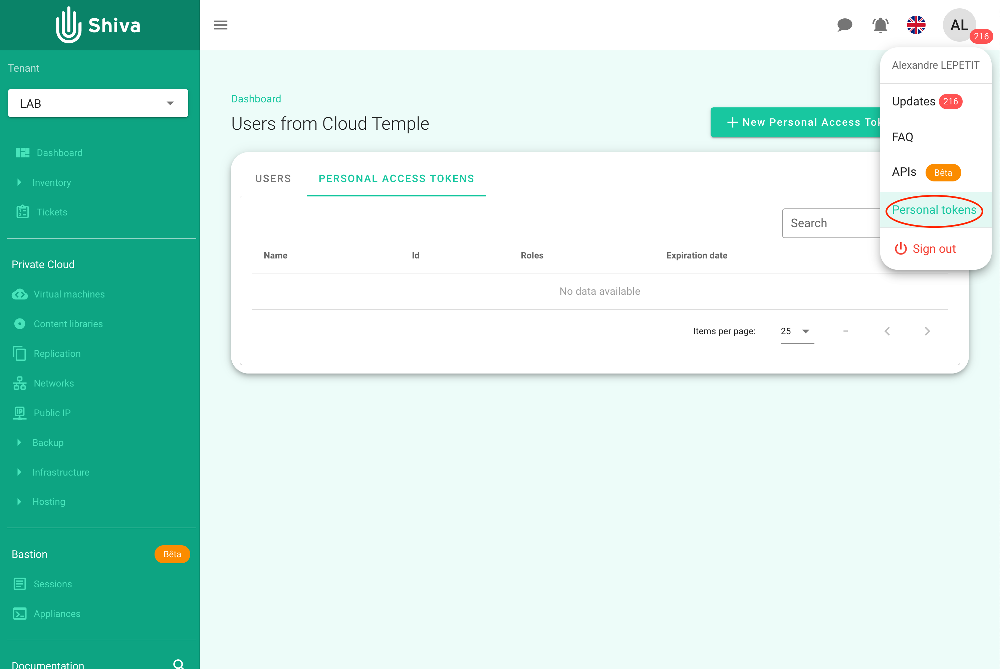
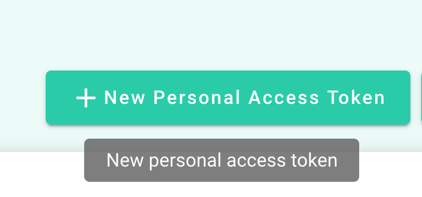
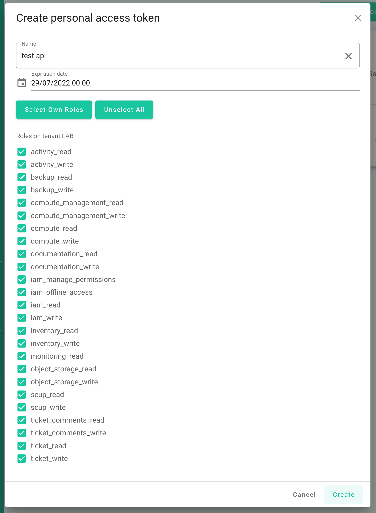
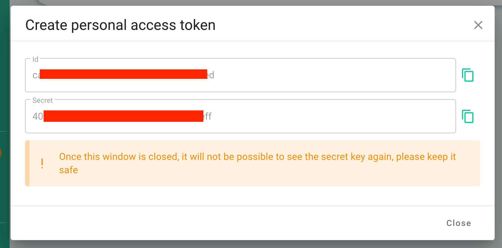

# Shiva API library
Small wrapper around Shiva APIs.
Shiva is the Cloud Management Platform of Cloud Temple.

## Sample script
You have samples scripts in folder tests/

# Prepare your environment

## Generate your PAT (Personal Access Token)
### Go to menu Personal Token

### Clic on new

### Configure

### Save your secret

